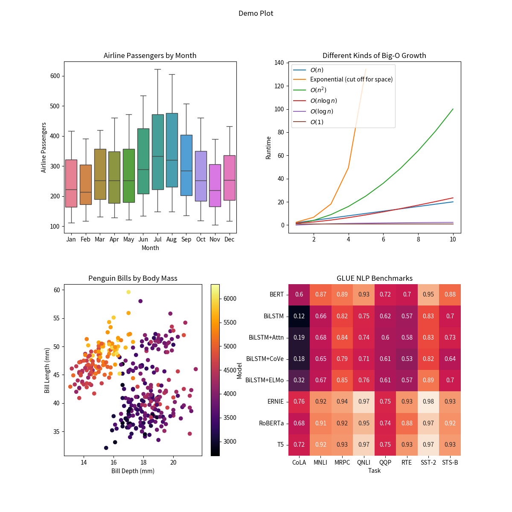

# Rho+

## The Python data viz nitro canister you didn't know you needed 🚀

When doing exploratory data analysis, your focus should be on the data itself—not how to plot it. Rho+ is a library that deals with common data visualization problems so you don't have to:

 - **Suitable for lazy mornings and late nights alike**: Switch from light to dark mode in a single line of code.
 - **Beautiful by default**: A minimalist, opinionated "house style" that harmonizes across different data viz tools.
 - **Composable and self-contained**: What can't be done through theming is done through modifying existing figures: there's no need to modify existing plotting code.

## Installation

Rho+ needs `matplotlib`, but it doesn't include `plotly`, `bokeh`, `altair`, or `panel` by itself. You'll need to install those to use the features in Rho+ that rely on them.

```bash
pip install rho_plus
```

## Demo

Rho+ includes several custom additions to Matplotlib's functionality, and a custom Matplotlib theme that can be set to either light or dark mode.

```python
import matplotlib.pyplot as plt
import rho_plus as rp

theme, cs = rp.mpl_setup(is_dark=True, setup=True)
```

Now `theme` is the full Matplotlib theme, `cs` is a list of the default plot cycle colors, and Matplotlib has been set up to use a dark theme.

A showcase of what adding Rho+ can do for your plots:

Default Matplotlib:



Rho+, with light mode:


Rho+, with dark mode (just changing `is_dark=False` to `is_dark=True`, no plotting code modification required):


## Features
* Switch from light to dark mode in one line
* A library of quantitative colormaps optimized for fidelity and aesthetic appeal in both light and dark mode
* An extensively tuned set of 12 categorical colors, with paired light/dark mode versions
* Use expressions as column names: `sns.lineplot(df, x='col_1 / col_2', y='log(col_3) * 5')`
* Smooth out jagged or noisy line plots
* Annotate lineplots and scatterplots with text labels
* Use Y-Axis labels that don't require craning your neck to read
* Adjust axis limits to show the min and max of the data
* Minimalist box plot styling using `sns.rp_boxplot`

## Documentation
To learn more about everything Rho+ offers, consult the [user guide](https://nicholas-miklaucic.github.io/rho_plus/source/user_guide/).

To learn about the colormaps Rho+ has, combined with a guide to picking the best one for your application, consult [the quantitative colormaps help page](https://nicholas-miklaucic.github.io/rho_plus/source/quantitative_colormaps/).

## Philosophy
The theming and aesthetics of Rho+ are, hopefully, strict improvements over the existing defaults. They're suitable for any application, from random exploration in a notebook to figures in a scientific publication.

On the other hand, functions like `scatter_labels()` attempt to solve challenging, often NP-hard, problems. Rho+ prioritizes ease of use over flexibility or reproducibility, which may not be appropriate for everyone. A lot of work has gone into intelligent heuristics and algorithms that run quickly and get good answers, but perfection is not the goal.

The intended use case is exploratory data analysis in a notebook, where a function like `scatter_labels` can help you identify "hey, what's that weird outlier" in a single line of code.

If instead you're building a pipeline or dashboard, or making figures for publication, you won't find a lot of dials to tweak or ways to ensure reproducibility in these functions. Changes to the algorithms—which points get labeled, how lines get smoothed, etc.—are not breaking changes, and can happen without warning as the internal heuristics are optimized. By looking at the source code, you might find some inspiration for what algorithms you could apply to your own data that would ensure replicable results of higher quality in your specific application.

## Issues
If things don't work as you expect or you have ideas for improvements, please consider filing an issue or, better yet, a pull request!
