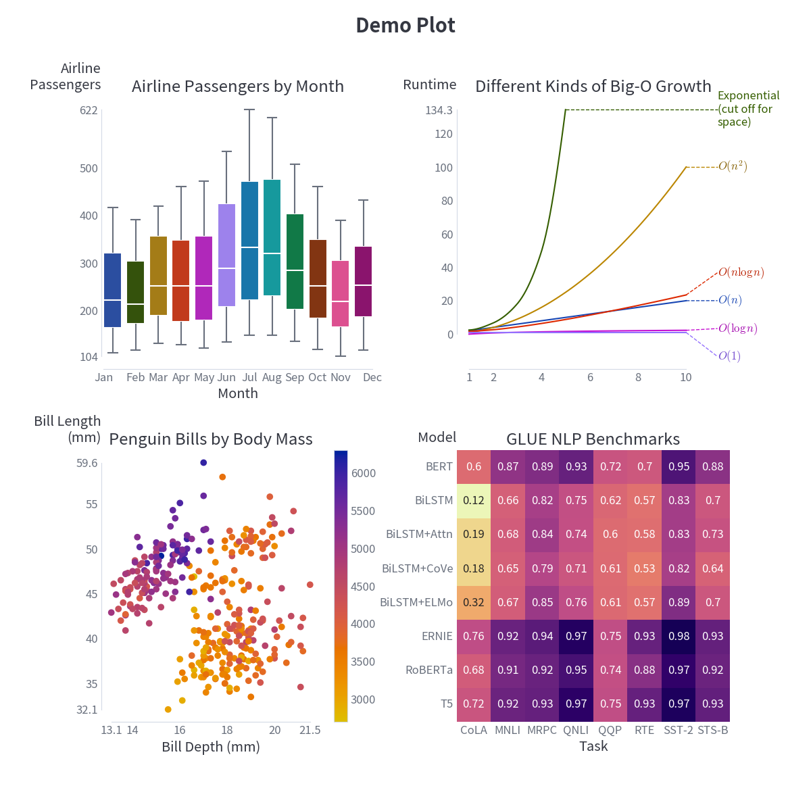

# Rho+

## Aesthetic and ergonomic enhancements for common Python data science tools

This is basically the stuff I wish came by default in libraries like `numpy`, `pandas`, and `matplotlib` that doesn't.

### Installation

Rho+ doesn't include plotting libraries itself, so it maps correctly to your current version with whatever settings you gave it.

You'll need a recent version of `matplotlib` to make things work:

```bash
pip install --upgrade matplotlib
```

Then, run

```bash
pip install rho_plus
```

Other libraries that `rho_plus` works well with:

- `altair`
- `seaborn`
- `holoviews`
- `hvplot`
- `bokeh`
- `panel`
- `plotly`

### Gallery/User Guide

To see what Rho+ has to offer in an interactive environment, my recommendation is to use the Google Colab notebook found here:

[https://colab.research.google.com/drive/13XM2IL53TqGQlNXCv8kW5pMbj2H7WChP#sandboxMode=true](https://colab.research.google.com/drive/13XM2IL53TqGQlNXCv8kW5pMbj2H7WChP#sandboxMode=true)

This lets you explore the interactive features on top of the other functionality and change things as you desire.

Simply run the installation cell at the top, Runtime > Run All, and check it out!

### Matplotlib Demo

Rho+ includes several custom additions to Matplotlib's functionality, and a custom Matplotlib theme that can be set to either light or dark mode.

```python
import matplotlib.pyplot as plt
import rho_plus as rp

theme, cs = rp.mpl_setup(is_dark=True, setup=True)
```

Now `theme` is the full Matplotlib theme, `cs` is a list of the default plot cycle colors, and Matplotlib has been set up to use a dark theme.

Here's a showcase of what all of the Matplotlib tools in Rho+ do. For code, check the showcase.

Default Matplotlib:


Rho+, with light mode:



Rho+, with dark mode:


If things don't work as you expect or you have ideas for improvements, please consider filing a pull request!
